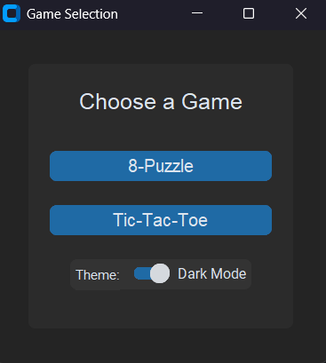
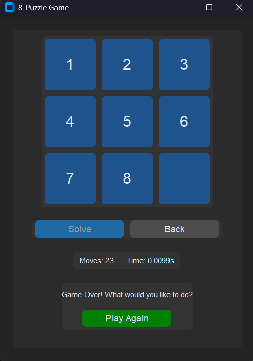
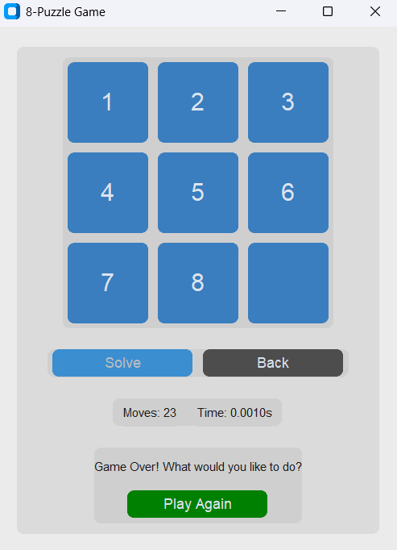
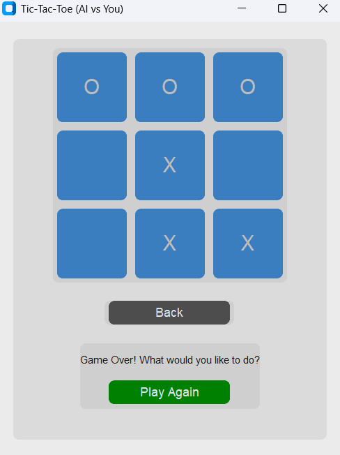
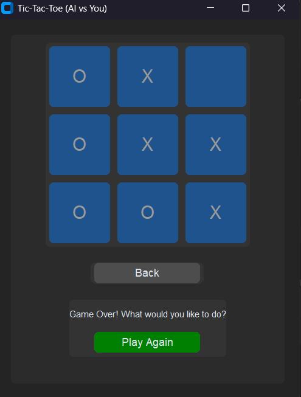

# 8-Puzzle & Tic-Tac-Toe Game Suite

## Overview
A Python-based game suite with **8-Puzzle** and **Tic-Tac-Toe**, built using `customtkinter` for a modern GUI. Solve the 8-Puzzle manually or with AI, or play Tic-Tac-Toe against an AI opponent. Features a game selection menu with light/dark theme toggle.

## Algorithms
- **8-Puzzle**:
  - **A* Search**: Finds the optimal solution using **Manhattan Distance** heuristic.
- **Tic-Tac-Toe**:
  - **Minimax**: Creates an unbeatable AI by evaluating all possible moves.

## Features
- **Game Menu**: Choose between 8-Puzzle or Tic-Tac-Toe, toggle theme.
- **8-Puzzle**:
  - Manual tile moves or AI solver with step-by-step animation.
  - Random solvable puzzles, move counter, and solving time.
  - Play again or return to menu.
- **Tic-Tac-Toe**:
  - Play as 'X' vs. AI ('O').
  - Detects wins, losses, or draws.
  - Play again or return to menu.

## Screenshots
### Game Menu


### 8-Puzzle Solved


### 8-Puzzle Game Over


### Tic-Tac-Toe Player Win


### Tic-Tac-Toe AI Win


## Installation
1. Clone the repo:
   ```bash
   git clone <repository-url>
   ```
2. Install dependencies:
   ```bash
   pip install customtkinter
   ```
3. Run:
   ```bash
   python main.py
   ```

## Requirements
- Python 3.x
- `customtkinter`

## License
MIT License
